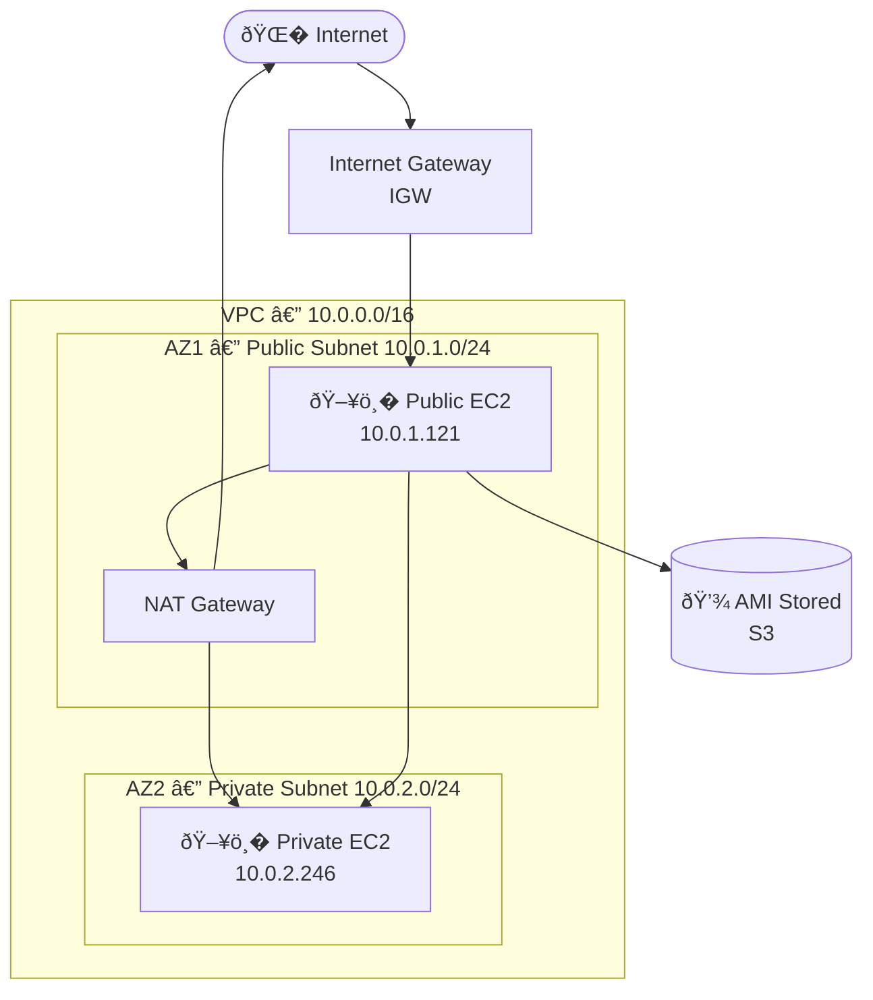

# Architecture Diagram

```mermaid
flowchart TD
    Internet([� Internet])
    IGW[Internet Gateway\nIGW]
    
    Internet --> IGW
    IGW --> PublicEC2

    subgraph VPC["VPC — 10.0.0.0/16"]
        subgraph AZ1["AZ1 — Public Subnet 10.0.1.0/24"]
            PublicEC2[🖥ö¸� Public EC2\n10.0.1.121]
            NAT[NAT Gateway]
        end

        subgraph AZ2["AZ2 — Private Subnet 10.0.2.0/24"]
            PrivateEC2[🖥ö¸� Private EC2\n10.0.2.246]
        end
    end

    PublicEC2 --> NAT
    NAT --> PrivateEC2
    NAT --> Internet
    PublicEC2 --> PrivateEC2
    PublicEC2 --> AMI

    AMI[(💾 AMI Stored\nS3)]
```
